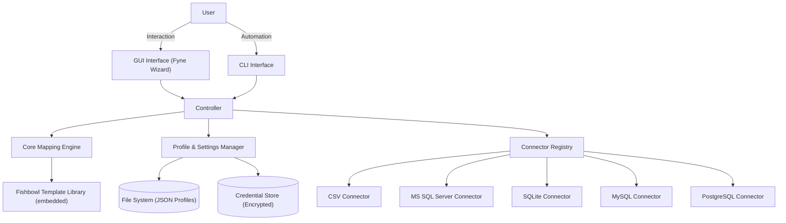

**Parent:** [[Project - Data Coupler Summary]]

# 1. System Overview

**Project Data Coupler** is a local desktop ETL wizard. It guides the user step by step through connecting to a data source, querying or loading that data, cleaning and transforming it, mapping it to an output format (including pre-built templates for platforms like Fishbowl), and exporting the result — ready to import.

**Design Philosophy:**

* **Plain Language:** Terminology must be accessible to non-technical users. Use "Input" and "Output" exclusively. Avoid ETL jargon like "Source/Target/Ingest."
* **Universal Compatibility:** The tool must compile and run on Windows, macOS, and Linux.
* **Wizard-Driven UX:** Guide the user through one decision at a time. Never dump everything on a single form.
* **Connector Interface:** Every input/output driver implements the same interface. Adding a new database is adding one file, not rewriting the app.
* **Single Binary:** No installers, no runtimes. One executable, drop it in a folder.

---

## High-Level Architecture



---

# 2. Project File Structure

*Strict adherence to this layout is required to maintain the Single Binary architecture.*

```text
Data-Coupler/
├── cmd/
│   └── datacoupler/
│       └── main.go              # Entry point. Flags → CLI. No flags → GUI.
├── internal/
│   ├── engine/                  # The Mapper. Pure logic. No UI code.
│   ├── connector/               # Connector interface + registry.
│   │   ├── connector.go         # The Connector interface definition.
│   │   ├── registry.go          # ConnectorRegistry: register & look up connectors.
│   │   ├── csv/                 # CSV file connector.
│   │   ├── mssql/               # Microsoft SQL Server connector.
│   │   ├── sqlite/              # SQLite connector.
│   │   ├── mysql/               # MySQL connector.
│   │   └── postgres/            # PostgreSQL connector.
│   ├── transform/               # Transform pipeline.
│   │   ├── transform.go         # Transformer interface + registry.
│   │   └── builtins.go          # TrimSpace, ToUpper, DateFormat, etc.
│   ├── config/                  # IO for loading/saving JSON profiles.
│   ├── credentials/             # Encrypted local credential storage.
│   ├── templates/               # Fishbowl template definitions (embedded).
│   │   └── fishbowl/
│   │       ├── parts.json
│   │       ├── customers.json
│   │       ├── vendors.json
│   │       └── ...
│   ├── types/                   # Shared data structs (Profile, Mapping, etc.)
│   └── ui/                      # Fyne wizard screens and navigation logic.
│       ├── wizard.go            # Wizard shell (step navigation).
│       ├── step_source.go       # Step 1: Choose Input Source
│       ├── step_query.go        # Step 2: SQL Query / File Pick + Preview
│       ├── step_output.go       # Step 3: Choose Output Destination
│       ├── step_mapping.go      # Step 4: Map Columns
│       ├── step_transform.go    # Step 5: Configure Transforms
│       └── step_review.go       # Step 6: Review & Run
├── profiles/                    # User's saved JSON profile files.
├── go.mod
└── build_and_test.ps1
```

**Key Rules:**
* The GUI (`internal/ui`) and Engine (`internal/engine`) must **never** import each other. They communicate only via structs defined in `internal/types`.
* Connector packages must only implement the `Connector` interface — they must not contain any UI code.
* The Transform pipeline is stateless — a transform takes a string value and returns a string value.

---

# 3. Data Architecture

## 3.1 The Profile Schema (`profiles/*.json`)

*The profile is the full saved state of a conversion workflow. It captures everything needed to re-run the job without any user input.*

```json
{
  "id": "macola-parts-to-fishbowl",
  "name": "Macola Parts → Fishbowl Import",
  "description": "Exports active parts from Macola and maps to Fishbowl Parts template.",
  "version": 2,
  "input": {
    "connector": "mssql",
    "credentialRef": "macola-prod",
    "query": "SELECT ITEMNO, DESCRIP, PRICE FROM IM_ITEM WHERE STATUS = 'A'"
  },
  "output": {
    "connector": "csv",
    "path": "./output/fishbowl-parts.csv",
    "template": "fishbowl/parts"
  },
  "settings": {
    "skipHeader": true,
    "delimiter": ","
  },
  "mappings": [
    {
      "inputCol": "ITEMNO",
      "outputCol": "Part Number",
      "transforms": [
        { "type": "TrimSpace" }
      ]
    },
    {
      "inputCol": "DESCRIP",
      "outputCol": "Description",
      "transforms": [
        { "type": "TrimSpace" },
        { "type": "ToUpper" }
      ]
    },
    {
      "inputCol": "PRICE",
      "outputCol": "Price",
      "transforms": []
    }
  ]
}
```

## 3.2 Go Struct Definitions (`internal/types`)

```go
type Profile struct {
    ID          string    `json:"id"`
    Name        string    `json:"name"`
    Description string    `json:"description"`
    Version     int       `json:"version"`
    Input       IOConfig  `json:"input"`
    Output      IOConfig  `json:"output"`
    Settings    Settings  `json:"settings"`
    Mappings    []Mapping `json:"mappings"`
}

type IOConfig struct {
    Connector     string `json:"connector"`               // "csv", "mssql", "sqlite", "mysql", "postgres"
    CredentialRef string `json:"credentialRef,omitempty"` // key into credential store
    Query         string `json:"query,omitempty"`         // SQL query (database connectors)
    Path          string `json:"path,omitempty"`          // file path (CSV connector)
    Template      string `json:"template,omitempty"`      // e.g., "fishbowl/parts"
}

type Settings struct {
    SkipHeader bool   `json:"skipHeader"`
    Delimiter  string `json:"delimiter"`
}

type Mapping struct {
    InputCol   string      `json:"inputCol"`
    OutputCol  string      `json:"outputCol"`
    Transforms []Transform `json:"transforms"`
}

type Transform struct {
    Type   string            `json:"type"`
    Params map[string]string `json:"params,omitempty"`
}
```

---

# 4. Component Design

## 4.1 The Connector Interface (`internal/connector/connector.go`)

*The heart of the extensibility model. The engine never calls a database driver directly — it calls this interface.*

```go
type Connector interface {
    // Name returns the connector's identifier, matching profile JSON "connector" field.
    Name() string

    // Connect establishes a connection using the provided config.
    Connect(cfg ConnectionConfig) error

    // Disconnect closes the connection and frees resources.
    Disconnect() error

    // Columns runs the query and returns the column header names only.
    // Used for the mapping preview step without fetching all rows.
    Columns(query string) ([]string, error)

    // Rows runs the query and returns rows as a channel of string slices.
    // Streaming avoids loading large datasets entirely into memory.
    Rows(query string) (<-chan []string, error)
}

type ConnectionConfig struct {
    Host     string
    Port     int
    Database string
    Username string
    Password string // Resolved from credential store at runtime. Never stored in profile JSON.
    FilePath string // Used by file-based connectors like SQLite and CSV.
    Extra    map[string]string // Driver-specific options.
}
```

### Connector Registry (`internal/connector/registry.go`)

```go
// Connectors are registered once at application startup in main.go.
// After that, the engine and GUI look them up by name.

var registry = map[string]Connector{}

func Register(c Connector)          { registry[c.Name()] = c }
func Get(name string) (Connector, bool) { c, ok := registry[name]; return c, ok }
```

**Registering connectors in `main.go`:**
```go
connector.Register(&csv.CSVConnector{})
connector.Register(&mssql.MSSQLConnector{})
connector.Register(&sqlite.SQLiteConnector{})
connector.Register(&mysql.MySQLConnector{})
connector.Register(&postgres.PostgreSQLConnector{})
```

Adding a new database in the future requires: create one new package in `internal/connector/`, implement the interface, add one `Register` line to `main.go`. Nothing else changes.

---

## 4.2 The Transform Pipeline (`internal/transform`)

*Transforms are stateless functions. Each takes a string value and returns a string value. They are chained per-column.*

```go
type Transformer interface {
    Name()  string
    Apply(value string, params map[string]string) (string, error)
}
```

**Built-in Transforms:**

| Transform | Params | Example |
|---|---|---|
| `TrimSpace` | none | `"  Acme Corp  "` → `"Acme Corp"` |
| `ToUpper` | none | `"acme"` → `"ACME"` |
| `ToLower` | none | `"ACME"` → `"acme"` |
| `DateFormat` | `from`, `to` | `"01/15/2025"` → `"2025-01-15"` |
| `Concatenate` | `cols` (comma list), `separator` | `["John", "Doe"]` → `"John Doe"` |
| `Split` | `separator`, `index` | `"123-456-789"` + index 1 → `"456"` |
| `LookupReplace` | `map` (JSON object) | `"01"` → `"Category A"` |
| `Default` | `value` | `""` → `"N/A"` |
| `Prefix` | `value` | `"123"` → `"PART-123"` |
| `Suffix` | `value` | `"123"` → `"123-US"` |

**Pipeline execution in the engine:**
```go
func applyTransforms(value string, transforms []types.Transform) (string, error) {
    for _, t := range transforms {
        fn, ok := transform.Get(t.Type)
        if !ok {
            return "", fmt.Errorf("unknown transform: %s", t.Type)
        }
        var err error
        value, err = fn.Apply(value, t.Params)
        if err != nil {
            return "", err
        }
    }
    return value, nil
}
```

*The `TrimSpace` transform is the direct solution to Macola's trailing whitespace problem. It should be the default suggested transform whenever a MSSQL/Macola source is selected.*

---

## 4.3 The Core Engine (`internal/engine`)

*The engine is stateless. It doesn't know about the GUI, the CLI, or which specific connectors are in use.*

**Primary Interface:**
```go
func Run(profile types.Profile, credStore credentials.Store) error
```

**Logic Flow:**
1. **Resolve Input Connector:** Look up `profile.Input.Connector` in the registry.
2. **Connect Input:** Call `connector.Connect()` with credentials resolved from the credential store.
3. **Fetch Headers:** Call `connector.Columns(profile.Input.Query)` to validate all `inputCol` values in the profile exist in the data. Return a descriptive error if any are missing.
4. **Resolve Output Connector:** Look up `profile.Output.Connector` in the registry.
5. **Connect Output / Open File:** Prepare the output destination.
6. **Stream Rows:** Iterate over `connector.Rows()` channel.
   * For each row, create a blank output row.
   * For each mapping: look up the input column index, read the value, run the transform pipeline, write to output position.
7. **Finalize Output:** Flush writer, close connections.
8. **Return** row count and any non-fatal warnings (e.g., blank values in required fields).

---

## 4.4 The Wizard GUI (`internal/ui`)

*The GUI is a linear step-by-step wizard. Each screen handles exactly one decision. The user can go back at any step.*

### Wizard State (`WizardState`)

A single struct passed between wizard steps that accumulates the user's choices:

```go
type WizardState struct {
    InputConnectorName string
    InputConfig        connector.ConnectionConfig
    InputQuery         string
    InputHeaders       []string
    InputPreviewRows   [][]string

    OutputConnectorName string
    OutputConfig        connector.ConnectionConfig
    OutputTemplate      string

    Mappings  []types.Mapping
    Settings  types.Settings
    SavedName string
}
```

### Step Screens

**Step 1 — Choose Input Source**
Options presented as large clickable cards:
* 📄 CSV File
* 🗄️ SQL Database (Microsoft SQL Server, MySQL, SQLite, PostgreSQL — sub-selection)

**Step 2A — CSV File Input**
* File picker (filters to `.csv`)
* Preview panel: first 10 rows in a table widget
* Confirm header row

**Step 2B — SQL Database Input**
* Connection form: Host, Port, Database, Username, Password
* "Test Connection" button — green checkmark or red error inline
* SQL query text area
* "Preview Query" button — runs query, shows first 10 rows
* *Note: Password is stored only in the local credential store. Never written to the profile JSON.*

**Step 3 — Choose Output**
Options as cards:
* 📄 CSV File — file path entry, delimiter choice
* 🐟 Fishbowl Template — opens template picker (grid of module cards)

**Step 4 — Map Columns**
* Two-column layout. Left = Input column headers. Right = Output column names (fixed if using a Fishbowl template; editable if plain CSV).
* Each output row has a dropdown to select which input column feeds it.
* Required output columns (from Fishbowl templates) are marked with a red asterisk.
* Unmapped required columns show a warning indicator.

**Step 5 — Transforms (Optional)**
* Displayed as an expandable panel per mapped column.
* "Add Transform" dropdown per column. Fills in a param form for the chosen transform.
* Live before/after preview showing sample values from the input preview data.
* *For any MSSQL source, display a persistent suggestion: "Macola data often has trailing spaces — consider adding TrimSpace to all columns."*

**Step 6 — Review & Run**
* Summary card: Input source, Output destination, Profile name, Row count estimate.
* Validation report: any missing required fields listed clearly.
* **Run** button (disabled if validation errors exist).
* Progress bar during execution.
* Result screen: rows processed, any warnings, link to open output file.
* Prompt: "Save this as a profile?" → name entry + Save button.

---

## 4.5 The CLI Mode

*Unchanged from Phase 1A. Flags-based interface for automation and scripting.*

**Flags:**
* `-in`: Path to input CSV (or use `-profile` for database sources)
* `-out`: Path to output CSV
* `-profile`: Path to or ID of a saved profile
* `-dry-run`: Print output to console instead of file

---

# 5. Fishbowl Template Library

Templates are embedded into the binary at compile time using Go's `embed.FS`. They are never external files the user can accidentally delete.

**Template JSON Structure:**

```json
{
  "id": "fishbowl/parts",
  "name": "Fishbowl Parts Import",
  "description": "Import or update Part records in Fishbowl.",
  "columns": [
    { "name": "Part Number",  "required": true,  "description": "Unique part identifier." },
    { "name": "Description",  "required": true,  "description": "Part description." },
    { "name": "Part Type",    "required": true,  "description": "e.g., Inventory, Service, Labor." },
    { "name": "UOM",          "required": true,  "description": "Unit of measure (e.g., ea, ft, lb)." },
    { "name": "Price",        "required": false, "description": "Default sell price." },
    { "name": "Cost",         "required": false, "description": "Default cost." },
    { "name": "Active",       "required": false, "description": "true or false." }
  ]
}
```

---

# 6. Credential Storage

SQL connection passwords must **never** be written to profile JSON files. Profiles are text files that get shared, backed up, and version controlled. Passwords do not belong there.

**Design:**
* A `CredentialStore` stores entries keyed by a user-defined `credentialRef` string.
* The store is saved to an encrypted local file (`credentials.bin`) in the application directory.
* Encryption uses AES-GCM with a key derived from a machine-specific identifier (not a user password, for ease of use — the goal is preventing casual exposure in shared files, not enterprise-grade secrets management).
* The profile JSON stores only the `credentialRef` string. At runtime, the engine resolves the actual password from the store before connecting.

---

# 7. Error Handling

* **File Locks:** If the output CSV is open in Excel, the OS will block the write. Check for write permissions *before* running. Show a specific "Please close the file in Excel first" dialog.
* **BOM Handling:** Excel CSVs often include a UTF-8 Byte Order Mark. The CSV connector must detect and strip BOM from the first header byte.
* **Missing Columns:** If a profile's `inputCol` doesn't exist in the actual data, the engine returns a clear error naming the missing column. It does not silently write blank values.
* **Transform Errors:** If a transform fails on a specific cell (e.g., `DateFormat` receives a value that isn't a date), log the row number and cell value as a warning and write a blank. Do not abort the entire run.
* **Connection Failures:** Database connection errors surface immediately at the "Test Connection" step — not mid-run.

---

# 8. Testing Plan

## 8.1 Unit Tests (`go test ./...`)

* **Engine:** Feed mock data and a mock profile; assert output matches expected CSV.
* **Each Transform:** Table-driven tests covering normal input, empty input, and edge cases.
* **Each Connector:** Mock the database driver; test `Columns()` and `Rows()` behavior.
* **Profile Parsing:** Ensure JSON unmarshalling handles missing optional fields gracefully.
* **Fishbowl Template Loading:** Assert all bundled templates load without error and required fields are correctly identified.

## 8.2 Integration Tests

* **End-to-End CSV:** Script in `build_and_test.ps1` runs the compiled binary against a sample CSV and verifies the output file.
* **End-to-End MSSQL:** Requires a test SQL Server instance (Docker). Runs a known query and verifies output.

## 8.3 Manual Test Data

* Include a `testdata/` folder with:
  * A sample Macola-style CSV (with trailing spaces on all string fields) for testing `TrimSpace`
  * A sample input CSV that maps to the Fishbowl Parts template
